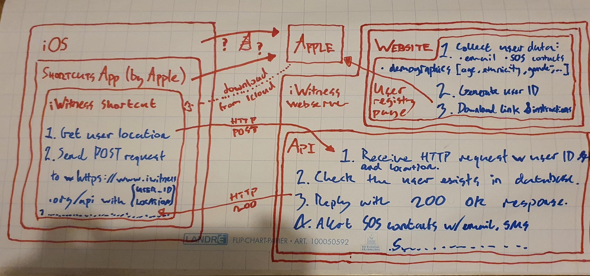

# SERVER

This server consists of:

- a Node.js backend exposing a REST API written with the Express library;
- an Angular frontend (i.e. the website), and;
- a Postgres database.

## Design

This (very) rough sketch outlines the interaction between the _client_ (the user's iOS device) and this server,  
plus interaction with Apple.  

## Prerequisites

Before development, you need to:

- clone this repository to your machine;
- install Postgres on your machine, create yourself a user and database, and start the server, and;
- set the `DATABASE_URL` environment variable to reference your local database by running `export DATABASE_URL=postgres://$(whoami)@localhost:5432/$(whoami)?sslmode=disable` from the terminal.

## Build pipeline

1. The developer pushes changes to GitHub.
2. The GitHub CI action runs all unit tests.
3. If all tests have succeeded, Heroku builds and deploys the server.

## Useful commands (npm)

Execute using `npm run command-name` from the terminal.

### `build:dist`

Build the frontend static files to `dist/`, where they can be served by the backend.  
Runs automatically after `npm install`, in order to deploy using Heroku.

### `start:frontend`

Serve _only_ the frontend at http://localhost:4200, hot-reloading after code changes.  
Useful for frontend development when the backend is not required.

### `start`

Start the backend _and_ frontend at http://localhost:8080 serving both the API endpoints and the frontend.  
Can be run locally for development or by Heroku for production.

### `test:chromium`

Open a Chromium browser, run unit tests and display the results.  
Tests are re-run after code changes.

### `test:ci`

Run unit tests without opening a browser, while using Chrome in the background.  
Used by GitHub for continuous integration (CI).

### `prettier:write`

Format all files in the project.

## Useful commands (heroku)

The server can be deployed into production from the terminal using the [Heroku CLI](https://devcenter.heroku.com/articles/heroku-cli).